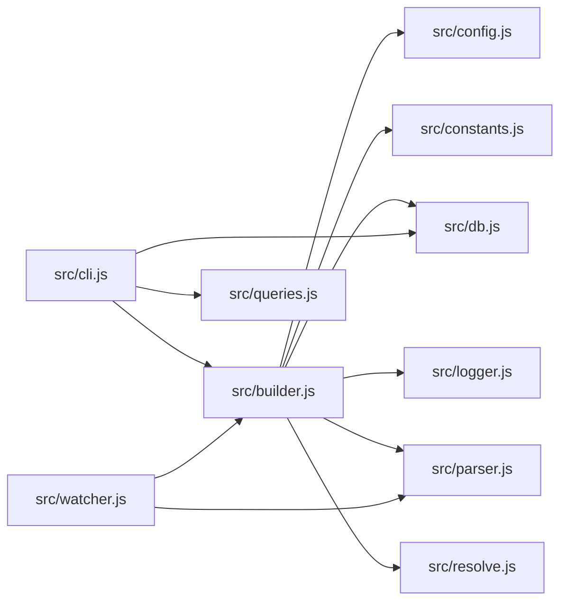
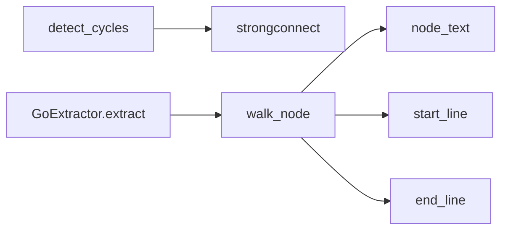

# CLI Examples

Real output from running codegraph on its own codebase — what you'll see after `npm install -g @optave/codegraph && codegraph build .`

---

## build — Parse and index your project

```bash
codegraph build .
```

```
Using wasm engine
Loaded path aliases: baseUrl=none, 2 path mappings
Found 65 files to parse
Parsed 65 files (42 changed, 0 removed)
Resolved 696 edges
Graph built in 1.2s → .codegraph/graph.db
```

Incremental rebuilds only re-parse changed files:

```
No changes detected. Graph is up to date.
```

---

## stats — Graph health at a glance

```bash
codegraph stats -T
```

```
# Codegraph Stats

Nodes:     479 total
  function 349      file 65           struct 23
  method 21         directory 18      trait 1
  enum 1            class 1

Edges:     696 total
  calls 526         contains 77       imports 68
  reexports 25

Files:     65 (2 languages)
  javascript 46     rust 19

Cycles:    1 file-level, 2 function-level

Top 5 coupling hotspots:
   1. src/parser.js                       fan-in:  16  fan-out:  13
   2. src/db.js                           fan-in:  20  fan-out:   1
   3. src/builder.js                      fan-in:   8  fan-out:   8
   4. src/index.js                        fan-in:   1  fan-out:  14
   5. src/queries.js                      fan-in:  11  fan-out:   4

Embeddings: not built

Graph Quality: 84/100
  Caller coverage:  63.2% (234/370 functions have >=1 caller)
  Call confidence:  97.8% (660/675 call edges are high-confidence)
```

---

## where — Quick symbol lookup

Find where a symbol is defined and who uses it:

```bash
codegraph where buildGraph -T
```

```
f buildGraph  src/builder.js:335  (exported)
  Used in: src/cli.js:77
```

File overview mode — list all symbols, imports, and exports in a file:

```bash
codegraph where -f src/db.js -T
```

```
# src/db.js
  Symbols: openDb:76, initSchema:84, findDbPath:120, openReadonlyOrFail:136
  Imports: src/logger.js
  Imported by: src/builder.js, src/cli.js, src/embedder.js, src/mcp.js, src/queries.js, src/structure.js
  Exported: openDb, initSchema, findDbPath, openReadonlyOrFail
```

---

## explain — Structural summary (file or function)

### On a file

```bash
codegraph explain src/builder.js -T
```

```
# src/builder.js
  949 lines, 10 symbols (4 exported, 6 internal)
  Imports: src/config.js, src/constants.js, src/db.js, src/journal.js, src/logger.js, src/parser.js, src/resolve.js
  Imported by: src/cli.js, src/watcher.js

## Exported
  f collectFiles :45
  f loadPathAliases(rootDir) :101
  f readFileSafe(filePath, retries = 2) :154
  f buildGraph(rootDir, opts = {}) :335

## Internal
  f fileHash(content) :131  -- Compute MD5 hash of file contents for incremental builds.
  f fileStat(filePath) :138  -- Stat a file, returning { mtimeMs, size } or null on error.
  f getChangedFiles(db, allFiles, rootDir) :176  -- Determine which files have changed since last build.
  f getResolved(absFile, importSource) :570
  f isBarrelFile(relPath) :595
  f resolveBarrelExport(barrelPath, symbolName, visited = new Set()) :604

## Data Flow
  getChangedFiles -> fileStat, readFileSafe, fileHash
  buildGraph -> loadPathAliases, collectFiles, getChangedFiles, fileStat, readFileSafe, fileHash
  resolveBarrelExport -> getResolved, isBarrelFile
```

### On a function

```bash
codegraph explain buildGraph -T
```

```
# buildGraph (function)  src/builder.js:335-882
  548 lines
  Parameters: (rootDir, opts = {})

  Calls (22):
    f openDb  src/db.js:76
    f initSchema  src/db.js:84
    f loadConfig  src/config.js:33
    f getActiveEngine  src/parser.js:316
    f loadPathAliases  src/builder.js:101
    f collectFiles  src/builder.js:45
    f getChangedFiles  src/builder.js:176
    f writeJournalHeader  src/journal.js:88
    f normalizePath  src/constants.js:37
    f parseFilesAuto  src/parser.js:277
    f resolveImportsBatch  src/resolve.js:150
    ...

  Called by (1):
    <- resolveNoTests  src/cli.js:59
```

---

## context — Everything you need to understand a function

```bash
codegraph context buildGraph -T
```

```
# buildGraph (function) — src/builder.js:335-948

## Type/Shape Info
  Parameters: (rootDir, opts = {})

## Source
  export async function buildGraph(rootDir, opts = {}) {
    const dbPath = path.join(rootDir, '.codegraph', 'graph.db');
    const db = openDb(dbPath);
    initSchema(db);

    const config = loadConfig(rootDir);
    const incremental =
      opts.incremental !== false && config.build && config.build.incremental !== false;

    const engineOpts = { engine: opts.engine || 'auto' };
    const { name: engineName, version: engineVersion } = getActiveEngine(engineOpts);
    ...
  }

## Dependencies
  -> openDb (src/db.js:76)
  -> initSchema (src/db.js:84)
  -> loadConfig (src/config.js:33)
  -> collectFiles (src/builder.js:45)
  ...

## Callers
  <- resolveNoTests (src/cli.js:59)
```

---

## fn — Function call chain

```bash
codegraph fn buildGraph -T
```

```
f buildGraph (function) -- src/builder.js:335

  -> Calls (22):
    -> f openDb  src/db.js:76
    -> f initSchema  src/db.js:84
    -> f loadConfig  src/config.js:33
    -> f getActiveEngine  src/parser.js:316
    -> f info  src/logger.js:18
    -> f loadPathAliases  src/builder.js:101
    -> f collectFiles  src/builder.js:45
    -> f getChangedFiles  src/builder.js:176
    -> f writeJournalHeader  src/journal.js:88
    -> f normalizePath  src/constants.js:37
    -> f parseFilesAuto  src/parser.js:277
    -> f fileStat  src/builder.js:138
    -> f readFileSafe  src/builder.js:154
    -> f fileHash  src/builder.js:131
    -> f resolveImportsBatch  src/resolve.js:150
    ...

  <- Called by (1):
    <- f resolveNoTests  src/cli.js:59
```

---

## deps — File-level imports

```bash
codegraph deps src/builder.js -T
```

```
# src/builder.js

  -> Imports (7):
    -> src/config.js
    -> src/constants.js
    -> src/db.js
    -> src/journal.js
    -> src/logger.js
    -> src/parser.js
    -> src/resolve.js

  <- Imported by (1):
    <- src/cli.js

  Definitions (10):
    f collectFiles :45
    f loadPathAliases :101
    f fileHash :131
    f fileStat :138
    f readFileSafe :154
    f getChangedFiles :176
    f buildGraph :335
    f getResolved :570
    f isBarrelFile :595
    f resolveBarrelExport :604
```

---

## fn-impact — Blast radius of a function change

```bash
codegraph fn-impact buildGraph -T
```

```
Function impact: f buildGraph -- src/builder.js:335

  -- Level 1 (1 functions):
      ^ f resolveNoTests  src/cli.js:59

  Total: 1 functions transitively depend on buildGraph
```

---

## impact — File-level transitive dependents

```bash
codegraph impact src/parser.js -T
```

```
Impact analysis for files matching "src/parser.js":

  # src/parser.js (source)

  -- Level 1 (4 files):
      ^ src/constants.js
      ^ src/watcher.js
      ^ src/builder.js
      ^ src/queries.js

  ---- Level 2 (4 files):
        ^ src/resolve.js
        ^ src/structure.js
        ^ src/cli.js
        ^ src/mcp.js

  Total: 8 files transitively depend on "src/parser.js"
```

---

## diff-impact — Impact of git changes

```bash
codegraph diff-impact main -T
```

```
  Changed files:
    M src/structure.js    (structureCmd, computeStructure)
    M src/queries.js      (findNodeByName)

  Impacted functions:
    -- Level 1:
        ^ resolveNoTests  src/cli.js:59
        ^ structureTool   src/mcp.js:312

  Total: 2 functions affected by this diff
```

Also available as a Mermaid diagram (`-f mermaid`) for visual impact graphs.

---

## map — Module overview

```bash
codegraph map --limit 10 -T
```

```
Module map (top 10 most-connected nodes):

  [src/]
    db.js                               <- 19 ->  1  = 20  ####################
    parser.js                           <- 15 -> 13  = 28  ############################
    logger.js                           <- 13 ->  0  = 13  #############
    native.js                           <- 10 ->  0  = 10  ##########
    queries.js                          <- 10 ->  4  = 14  ##############
    builder.js                          <-  7 ->  8  = 15  ###############
    constants.js                        <-  6 ->  1  =  7  #######
    cycles.js                           <-  5 ->  2  =  7  #######
    resolve.js                          <-  5 ->  2  =  7  #######
  [src/extractors/]
    helpers.js                          <-  9 ->  0  =  9  #########

  Total: 101 files, 591 symbols, 933 edges
```

---

## structure — Project directory tree with metrics

```bash
codegraph structure --depth 2 -T
```

```
Project structure (15 directories):

crates/  (0 files, 0 symbols, <-0 ->0)
  crates/codegraph-core/  (0 files, 0 symbols, <-0 ->0)
scripts/  (2 files, 8 symbols, <-0 ->0)
  embedding-benchmark.js  146L 3sym <-0 ->0
  update-benchmark-report.js  229L 5sym <-0 ->0
src/  (9 files, 92 symbols, <-6 ->20 cohesion=0.32)
  builder.js  883L 10sym <-2 ->7
  cli.js  570L 1sym <-0 ->10
  db.js  147L 4sym <-7 ->1
  embedder.js  714L 16sym <-2 ->2
  mcp.js  585L 2sym <-1 ->3
  queries.js  2318L 44sym <-3 ->4
  registry.js  163L 7sym <-2 ->1
  structure.js  507L 8sym <-1 ->4
  src/extractors/  (0 files, 0 symbols, <-0 ->0)
tests/  (0 files, 32 symbols, <-0 ->6 cohesion=0.00)
  tests/integration/  (0 files, 0 symbols, <-0 ->2)
  tests/search/  (0 files, 4 symbols, <-0 ->2)
  tests/unit/  (0 files, 28 symbols, <-0 ->2)
```

---

## hotspots — Find structural hotspots

```bash
codegraph hotspots --metric fan-in -T
```

```
Hotspots by fan-in (file-level, top 10):

   1. src/db.js  <-7 ->1  (147L, 4 symbols)
   2. src/queries.js  <-3 ->4  (2318L, 44 symbols)
   3. src/builder.js  <-2 ->7  (883L, 10 symbols)
   4. src/embedder.js  <-2 ->2  (714L, 16 symbols)
   5. src/registry.js  <-2 ->1  (163L, 7 symbols)
   6. src/mcp.js  <-1 ->3  (585L, 2 symbols)
   7. src/structure.js  <-1 ->4  (507L, 8 symbols)
   8. src/cli.js  <-0 ->10  (570L, 1 symbols)
```

Other metrics: `fan-out`, `density`, `coupling`.

---

## cycles — Circular dependency detection

```bash
codegraph cycles
```

```
No circular dependencies detected.
```

When cycles exist:

```
Found 1 file-level cycle:

  Cycle 1 (2 files):
    src/parser.js -> src/constants.js -> src/parser.js
```

---

## export — Graph as DOT, Mermaid, or JSON

### Mermaid (file-level)

```bash
codegraph export -f mermaid -T
```



### Mermaid (function-level)

```bash
codegraph export -f mermaid --functions -T
```



### DOT (Graphviz)

```bash
codegraph export -f dot -T
```

```dot
digraph codegraph {
  rankdir=LR;
  node [shape=box, fontname="monospace", fontsize=10];
  edge [color="#666666"];

  subgraph cluster_0 {
    label="src (cohesion: 0.32)";
    style=dashed;
    "src/builder.js" [label="builder.js"];
    "src/cli.js" [label="cli.js"];
    "src/db.js" [label="db.js"];
    ...
  }

  "src/builder.js" -> "src/db.js";
  "src/builder.js" -> "src/parser.js";
  "src/cli.js" -> "src/builder.js";
  ...
}
```

---

## search — Semantic search (requires `embed` first)

```bash
codegraph embed .
codegraph search "parse source files into AST"
```

```
Results for "parse source files into AST" (top 5):

  1. f parseFilesAuto  src/parser.js:277     score: 0.82
  2. f parseFile       src/parser.js:195     score: 0.76
  3. f buildGraph      src/builder.js:335    score: 0.68
  4. f collectFiles    src/builder.js:45     score: 0.61
  5. f extractSymbols  src/parser.js:142     score: 0.55
```

---

## models — Available embedding models

```bash
codegraph models
```

```
Available embedding models:

  minilm        384d  256 ctx   Smallest, fastest (~23MB). General text. (default)
  jina-small    512d  8192 ctx  Small, good quality (~33MB). General text.
  jina-base     768d  8192 ctx  Good quality (~137MB). General text, 8192 token context.
  jina-code     768d  8192 ctx  Code-aware (~137MB). Trained on code+text, best for code search.
  nomic         768d  8192 ctx  Good local quality (~137MB). 8192 context.
  nomic-v1.5    768d  8192 ctx  Improved nomic (~137MB). Matryoshka dimensions, 8192 context.
  bge-large    1024d  512 ctx   Best general retrieval (~335MB). Top MTEB scores.
```

---

## info — Engine diagnostics

```bash
codegraph info
```

```
Codegraph Diagnostics
====================
  Version       : 2.3.0
  Node.js       : v22.18.0
  Platform      : win32-x64
  Native engine : unavailable
  Engine flag   : --engine auto
  Active engine : wasm
```

---

## registry — Multi-repo management

```bash
codegraph registry list
```

```
Registered repositories:

  my-app
    Path: /home/user/projects/my-app
    DB:   /home/user/projects/my-app/.codegraph/graph.db

  shared-lib
    Path: /home/user/projects/shared-lib
    DB:   /home/user/projects/shared-lib/.codegraph/graph.db
```

```bash
codegraph registry add ~/projects/another-repo
codegraph registry remove old-repo
codegraph registry prune --ttl 30
```
